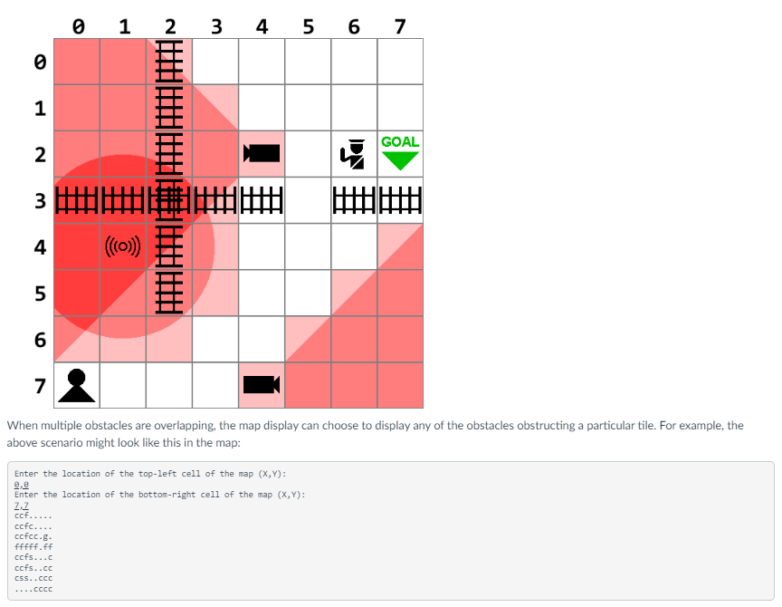

# README

## Project Title: Agent Obstacle Navigation System

### Overview

This C# and .NET 6.0-based application is designed for an unnamed information-gathering agency. The program assists field agents in securely navigating obstacles while gathering intelligence in restricted environments. Using a simple text-based menu, agents can input information about obstacles and request the safest path to their mission objectives.

### Features
1. **Menu-based User Interface**: Agents interact with the system through a text menu to:
   - Add obstacles (guards, fences, sensors, cameras, and custom obstacles).
   - Display the current obstacle map.
   - Check safe directions for movement.
   - Find a safe path to an objective.
2. **Obstacle Management**: Users can specify different obstacles, each with unique behavior:
   - **Guards** occupy a single location.
   - **Fences** stretch across multiple grid cells.
   - **Sensors** have a range within which they detect agents.
   - **Cameras** monitor a 90-degree field of view.
3. **Pathfinding Algorithm**: The system calculates and returns the safest possible path for the agent to reach their objective, avoiding all obstacles.

### Screenshot

### Code Structure

- **Program.cs**: This is the entry point of the application. It contains the main method and the logic for the text-based menu system.
- **Classes Folder**:
- **Obstacle.cs**: Base class representing a generic obstacle.
- **Guard.cs**: Derived class representing a guard obstacle.
- **Fence.cs**: Derived class representing a fence obstacle.
- **Sensor.cs**: Derived class representing a sensor obstacle.
- **Camera.cs**: Derived class representing a camera obstacle.
- **CustomObstacle.cs**: Derived class representing a unique obstacle as per the task requirement.
- **Pathfinding.cs**: Contains the logic for finding safe paths from the agent’s current location to the objective.
- **MapDisplay.cs**: Handles the generation and display of the obstacle map.

### Object-Oriented Design

The application employs object-oriented principles to manage various types of obstacles. Each obstacle type (Guard, Fence, Sensor, Camera) is represented by a class, inheriting common properties from a base `Obstacle` class.

- **Polymorphism**: Different obstacle types implement the logic for blocking paths in their own way.
- **Encapsulation**: Data related to obstacles (such as their location and range) is encapsulated within the respective classes and accessed via public methods.
- **Abstraction**: The system abstracts the complexities of navigation and obstacle management behind simple interfaces.

### Exception Handling

The program includes robust exception handling, ensuring that:
- Invalid inputs (e.g., non-numeric coordinates) are caught, and the user is prompted to re-enter the correct information.
- The program handles invalid obstacle placement gracefully without crashing.

### Testing

The project includes unit tests to ensure correctness and maintainability. These tests validate:
- Obstacle placement logic.
- Safe direction checking.
- Pathfinding results.

